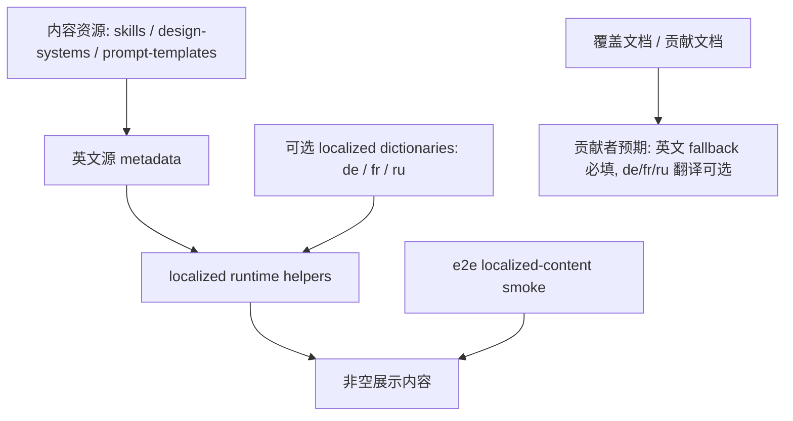

## Overview

### Problem Statement

- `apps/web/src/i18n` 下的内容翻译包含 `de`、`fr`、`ru`，但当前翻译覆盖不完整。
- 这些内容型 i18n 翻译需要改为非强制性，避免内容型贡献者必须补全相关语言内容。

### Goals

- 降低内容型贡献的门槛。
- 降低补全多语言内容时产生冲突的几率。

### Scope

- 调整 `apps/web/src/i18n` 下内容型翻译的要求，使 `de`、`fr`、`ru` 这类不完整翻译可选。

### Success Criteria

- 内容型贡献者可以提交主要内容变更，无需同时补全 `de`、`fr`、`ru` 的所有内容型 i18n 翻译。
- 不完整的 `de`、`fr`、`ru` 内容翻译不会阻塞相关贡献流程。

## Research

### Existing System

- `apps/web/src/i18n/content.ts` 聚合 `de`、`ru`、`fr` 三个 content bundle，并从各 bundle 的字典 key 构建 `LOCALIZED_CONTENT_IDS`。Source: `apps/web/src/i18n/content.ts:954-996`
- 当前 content ids 覆盖 6 类资源：skills、designSystems、designSystemCategories、promptTemplates、promptTemplateCategories、promptTemplateTags。Source: `apps/web/src/i18n/content.ts:26-33,981-989`
- 运行时本身已有英文 fallback：skill description / prompt、design-system summary、design-system category、prompt-template category / tags、prompt-template title / summary 缺翻译时会回退到源内容或原始标签。Source: `apps/web/src/i18n/content.ts:1010-1053`
- Web 单元测试确认 localized ids 只来自 localized dictionaries，同时确认缺少 localized copy 时字段级回退到英文源内容或原始 tag。Source: `apps/web/tests/i18n/content.test.ts:12-19,21-80`
- E2E localized-content 测试会从仓库真实资源读取 skills、design systems、prompt templates，并对 `de`、`fr`、`ru` 循环验证 display content。Source: `e2e/tests/localized-content.test.ts:333-377`

### Current Mandatory Translation Triggers

- Design System 新增全新 category 会触发强制补全：测试从 `design-systems/*/DESIGN.md` 的 `> Category:` 提取 category，并要求每个 locale 的 `ids.designSystemCategories` 包含所有发现到的 category。Source: `e2e/tests/localized-content.test.ts:194-240,390,398-401`
- Prompt Template 新增全新 category 会触发强制补全：测试从 `prompt-templates/image/*.json` 和 `prompt-templates/video/*.json` 读取 `category`，缺省为 `General`，并要求每个 locale 的 `ids.promptTemplateCategories` 覆盖所有发现到的 category。Source: `e2e/tests/localized-content.test.ts:243-330,391-405`
- Prompt Template 新增全新 tag 会触发强制补全：测试读取 prompt template 的 `tags` 数组并要求每个 locale 的 `ids.promptTemplateTags` 覆盖所有发现到的 tag。Source: `e2e/tests/localized-content.test.ts:313-318,394-409`
- Featured Skill / Design Template 的 locale 专属展示文案要求来自贡献文档：设置 `od.featured: 1` 时，文档要求在 `content.ts`、`content.fr.ts`、`content.ru.ts` 添加完整 localized display copy。Source: `docs/skills-contributing.md:197-202`

### Non-Mandatory or Already-Fallback Paths

- 新增普通 skill 或 design template 时，E2E 测试要求资源可显示；非 featured 路径通过 `SKILL.md` 英文 display fields 作为 fallback。Source: `docs/skills-contributing.md:188-195`; `e2e/tests/localized-content.test.ts:155-191,351-357`
- 新增 design system summary 时，文档说明 localized summary 字典只在已有翻译时更新，默认英文 fallback 自动生效。Source: `docs/design-systems.md:251-273`
- 新增 prompt template title / summary 时，E2E 测试只要求 localized result 非空；运行时会在缺 localized prompt-template copy 时回退到英文 `title` 和 `summary`。Source: `e2e/tests/localized-content.test.ts:366-375`; `apps/web/src/i18n/content.ts:1045-1051`
- Scenario tag 的 UI 标签使用 `SCENARIO_LABEL_KEY` 中的固定 i18n key；未知 tag 会 title-case 原 tag。Source: `apps/web/src/components/ExamplesTab.tsx:51-70,423-431`

### Available Approaches

- 调整 E2E category/tag 覆盖断言，让 `de`、`fr`、`ru` content dictionaries 对 design-system categories、prompt-template categories、prompt-template tags 变为可选，并依赖现有运行时 fallback。Source: `e2e/tests/localized-content.test.ts:380-409`; `apps/web/src/i18n/content.ts:1031-1052`
- 保留资源可显示的 smoke coverage：继续验证 skills、design systems、prompt templates 在 `de`、`fr`、`ru` 下会得到非空展示内容。Source: `e2e/tests/localized-content.test.ts:333-377`
- 更新贡献文档，把 featured localized copy 从强制要求改为可选或推荐，并明确英文 fallback 路径。Source: `docs/skills-contributing.md:188-202`
- 同步更新覆盖文档中关于 localized-content 的描述，使其表达“可显示 + fallback”而非“每个 locale 都覆盖所有 id / category / tag”。Source: `docs/testing/e2e-coverage/settings.md:68-69,121`

### Constraints & Dependencies

- `LOCALIZED_CONTENT_IDS` 目前直接由 localized dictionaries 的 key 生成；任何仍使用这些 ids 做 array-containing 全量覆盖的测试都会把缺翻译变成阻塞。Source: `apps/web/src/i18n/content.ts:981-996`; `e2e/tests/localized-content.test.ts:398-409`
- Prompt template category 缺失时会被测试资源读取逻辑归为 `General`；新增 template 未设置 category 时仍会纳入 `General` 的覆盖集合。Source: `e2e/tests/localized-content.test.ts:311-312`
- Prompt template tags 会过滤掉非字符串和空字符串，强制覆盖只发生在有效非空 tag 上。Source: `e2e/tests/localized-content.test.ts:313-318`
- 贡献文档当前把 featured localized copy 标为 required path；实现变更需要同步文档，否则内容型贡献者仍会被文档要求补齐翻译。Source: `docs/skills-contributing.md:197-202,232-241`

### Key References

- `apps/web/src/i18n/content.ts:954-1053` - localized bundle、content ids、runtime fallback。
- `e2e/tests/localized-content.test.ts:333-409` - localized display coverage 与 category/tag 强制覆盖断言。
- `apps/web/tests/i18n/content.test.ts:12-80` - localized ids 与 fallback 单元测试。
- `docs/skills-contributing.md:188-202,232-241` - skill / design-template i18n 贡献要求。
- `docs/design-systems.md:251-273` - design-system localized summary fallback 文档。
- `docs/testing/e2e-coverage/settings.md:68-69,121` - e2e coverage 文档对 localized-content 的描述。

## Design

### Architecture Overview

### Change Scope

- Area: `e2e/tests/localized-content.test.ts` 的 category / tag 覆盖断言。Impact: 移除 `de` / `fr` / `ru` 字典必须覆盖所有 discovered design-system category、prompt-template category、prompt-template tag 的硬性要求，保留资源可显示 smoke。Source: `e2e/tests/localized-content.test.ts:333-409`
- Area: `apps/web/src/i18n/content.ts` runtime fallback。Impact: 作为可选翻译的运行时基础，不需要新增 fallback 机制。Source: `apps/web/src/i18n/content.ts:1010-1053`
- Area: `apps/web/tests/i18n/content.test.ts` fallback 单元测试。Impact: 补强或保留字段级 fallback 断言，确保缺 localized copy 时英文源字段继续生效。Source: `apps/web/tests/i18n/content.test.ts:21-80`
- Area: `docs/skills-contributing.md` 和 `docs/testing/e2e-coverage/settings.md`。Impact: 把贡献者要求和覆盖说明改成“英文 fallback 必填、localized copy 可选”。Source: `docs/skills-contributing.md:188-202,232-241`; `docs/testing/e2e-coverage/settings.md:68-69,121`
- Area: `docs/design-systems.md`。Impact: 保持现有 design-system fallback 文档语义一致，只有相关 wording 需要同步时再改。Source: `docs/design-systems.md:251-273`

### Design Decisions

- Decision: 不改 `LOCALIZED_CONTENT_IDS` 的生成方式；它继续表达“当前 locale 已经存在翻译的 id 集合”。Source: `apps/web/src/i18n/content.ts:981-996`; `apps/web/tests/i18n/content.test.ts:12-19`
- Decision: 删除或改写 e2e 中 `covers every discovered design-system category and prompt tag` 的全量覆盖断言，让 category / tag 字典 key 成为可选翻译清单。Source: `e2e/tests/localized-content.test.ts:380-409`; `apps/web/src/i18n/content.ts:1031-1052`
- Decision: 保留 `derives displayable resources from discovered English fallback content` 这条 e2e smoke，继续要求 skills、design systems、prompt templates 在 `de` / `fr` / `ru` 下能展示非空内容。Source: `e2e/tests/localized-content.test.ts:333-377`
- Decision: 保留资源读取阶段的 fail-fast 英文 fallback 校验，例如缺 `description`、design-system `category`、prompt-template `title` / `summary` 时继续失败。Source: `e2e/tests/localized-content.test.ts:155-179,194-240,243-330`
- Decision: 文档把 featured localized copy 改为推荐增强路径，贡献 PR 的 required path 聚焦完整英文 display copy 与 fallback 覆盖。Source: `docs/skills-contributing.md:188-202,232-241`
- Decision: 覆盖矩阵中的 SET-043 / SET-044 改写为 fallback 展示完整性与可选翻译校验，避免文档继续表达全 locale 全 id 覆盖。Source: `docs/testing/e2e-coverage/settings.md:68-69,121`

### Why this design

- 当前 runtime 已有字段级 fallback，变更主要是把测试与文档从“翻译完整性 gate”调整为“展示完整性 gate”。
- `LOCALIZED_CONTENT_IDS` 继续保留现有语义，后续仍可用于展示翻译覆盖情况或检查已存在翻译字典本身。
- 资源仍必须提供完整英文 metadata，缺少真正必需的 fallback 输入会继续早失败。

### Test Strategy

- E2E: 运行 `pnpm --filter @open-design/e2e test tests/localized-content.test.ts`，验证真实仓库资源在 `de` / `fr` / `ru` 下仍可展示，且 category / tag 缺翻译不会阻塞。Source: `e2e/tests/localized-content.test.ts:333-377`; `e2e/AGENTS.md:40-55`
- Web unit: 运行 `pnpm --filter @open-design/web test`，覆盖 localized ids 仍来自字典，以及 skill/design-system/prompt-template 字段级 fallback。Source: `apps/web/tests/i18n/content.test.ts:12-80`; `apps/AGENTS.md:27-33,47-59`
- Probe: 本地临时新增一个未补 `de` / `fr` / `ru` localized dictionary 的 probe 类内容资源，然后运行 CI 等价验证，确认英文 fallback 可显示且缺可选翻译不会阻塞；验证后移除临时 probe 内容。Source: `e2e/tests/localized-content.test.ts:155-409`; `docs/skills-contributing.md:188-202`
- Repo checks: 运行 `pnpm guard` 和 `pnpm typecheck`，覆盖仓库级脚本与类型边界。Source: `AGENTS.md#validation-strategy`

### Pseudocode

Flow:
  1. 读取真实资源并校验英文 fallback metadata 必填字段。
  2. 对 `de` / `fr` / `ru` 调用 runtime localization helper。
  3. 断言 skill description、design-system summary、prompt-template title / summary 非空。
  4. 让 design-system category、prompt-template category、prompt-template tag 缺 localized dictionary 时走原值 fallback。
  5. 文档说明 localized dictionaries 是可选增强，英文 fallback metadata 是贡献必填项。

### File Structure

- `e2e/tests/localized-content.test.ts` - 调整 category / tag 覆盖测试，保留真实资源 fallback smoke。
- `apps/web/tests/i18n/content.test.ts` - 保留或补强 fallback 单元测试。
- `docs/skills-contributing.md` - 更新 skill / design-template 贡献 i18n 要求。
- `docs/testing/e2e-coverage/settings.md` - 更新 localized-content 覆盖矩阵说明。
- `docs/design-systems.md` - 需要时同步 wording，保持 design-system fallback 文档一致。

### Interfaces / APIs

- 无外部 API、DTO、数据库 schema、sidecar protocol 变更。
- `LOCALIZED_CONTENT_IDS` 导出保持现状，继续表示已有 localized dictionary 的 key 集合。Source: `apps/web/src/i18n/content.ts:981-1000`

### Edge Cases

- Prompt template 没有 `category` 时继续归入 `General`，`General` 缺 localized copy 时 fallback 为原值。Source: `e2e/tests/localized-content.test.ts:311-312`; `apps/web/src/i18n/content.ts:1035-1052`
- Prompt template tags 只对有效非空字符串生效，缺 localized tag 时 fallback 为原 tag。Source: `e2e/tests/localized-content.test.ts:313-318`; `apps/web/src/i18n/content.ts:1045-1052`
- Featured skill 缺 localized copy 时展示英文 fallback，文档将其定位为推荐增强路径。Source: `docs/skills-contributing.md:188-202`
- 缺英文 fallback metadata 时继续失败，防止以空展示内容掩盖资源错误。Source: `e2e/tests/localized-content.test.ts:155-179,194-240,243-330`

## Plan

- [ ] Step 1: 调整 localized-content 测试 gate
  - [ ] Substep 1.1 Implement: 移除或改写 `LOCALIZED_CONTENT_IDS` 对 discovered category / tag 的全量覆盖断言。
  - [ ] Substep 1.2 Implement: 保留真实资源在 `de` / `fr` / `ru` 下非空显示的 fallback smoke。
  - [ ] Substep 1.3 Implement: 需要时增加 category / tag fallback 的直接断言，覆盖缺字典时返回原值。
  - [ ] Substep 1.4 Verify: 运行 `pnpm --filter @open-design/e2e test tests/localized-content.test.ts`。
- [ ] Step 2: 同步贡献和覆盖文档
  - [ ] Substep 2.1 Implement: 更新 `docs/skills-contributing.md`，把 featured localized copy 表达为可选增强路径。
  - [ ] Substep 2.2 Implement: 更新 `docs/testing/e2e-coverage/settings.md` 中 SET-043 / SET-044 的覆盖描述。
  - [ ] Substep 2.3 Implement: 复核 `docs/design-systems.md` 与新语义一致，必要时微调 wording。
  - [ ] Substep 2.4 Verify: 人工检查文档中不再把 `de` / `fr` / `ru` 内容翻译描述为内容型贡献的硬性阻塞项。
- [ ] Step 3: 回归验证
  - [ ] Substep 3.1 Verify: 运行 `pnpm --filter @open-design/web test`。
  - [ ] Substep 3.2 Verify: 本地临时新增一个未补 `de` / `fr` / `ru` localized dictionary 的 probe 类内容资源，运行 CI 等价验证，确认通过后移除 probe 内容。
  - [ ] Substep 3.3 Verify: 运行 `pnpm guard`。
  - [ ] Substep 3.4 Verify: 运行 `pnpm typecheck`。

## Notes

<!-- Optional sections — add what's relevant. -->

### Implementation

<!-- Files created/modified, decisions made during coding, deviations from design -->

### Verification

<!-- How the feature was verified: tests written, manual testing steps, results -->
